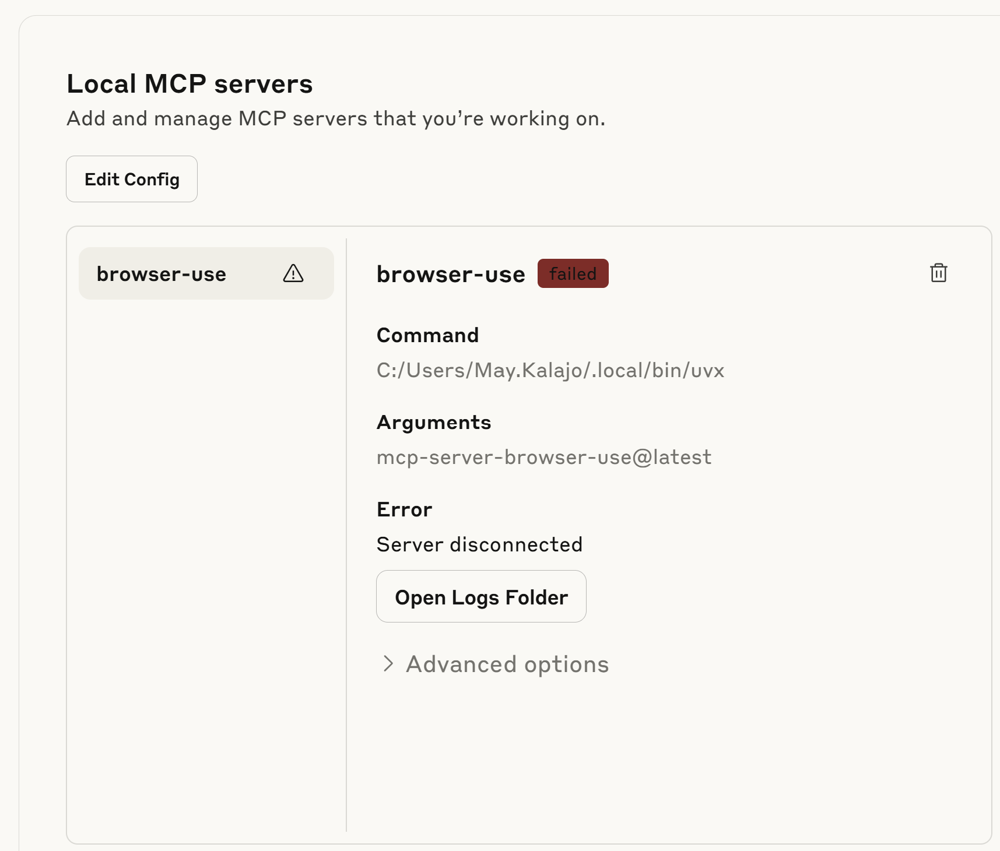

# MCP Web Scraping POC Documentation

## Provider Selection
- To connect a server from a GitHub repository rather than one of the MCP integrations that are already set up and accessible 
within the connectors tab, you can use the free version of Claude or ChatGPT (we have not explored other options)
- Since we believed initially that all MCP usage needed to be paid for, we ended up choosing Claude, since the version of ChatGPT
that supports MCP is $200 a month versus Claude's $20 a month
- However, in addition to this, you will also need to pay regardless in order to purchase tokens to be able to communicate with
the model. This cost breakdown is based on OpenRouter's cost breakdown rather than Anthropic's cost breakdown, since their token
prices are cheaper. Token prices are based on the number of tokens you send in and get out, and for Claude Sonnet 4, the model we
used, the token prices were $3/M input tokens and $15/M output tokens

## Prerequisites

Ensure you have Node.js installed first through npx. The latest version at the time of Node.js (v22.19.0) was used to run this project one of the team member's computers, and can be installed from the official website at https://nodejs.org/en/download.

## Installation Commands

```bash
curl -LsSf https://astral.sh/uv/install.sh | sh
uvx --from mcp-server-browser-use@latest python -m playwright install
```

## Initial CLI Attempt
- Attempted to open Chromium via CLI, but it was not linked to the project - 
- Reference: [Browser Use CLI Docs](https://docs.browser-use.com/cli) (FAILED)

## Configuration (include example Claude file?)
- Update `claude_desktop_config.json` to enable internet access for Claude.
-> On Windows, in order to locate, navigate to Users > Your.User > AppData > Roaming > Claude, and edit (or, if you do not find the file, create) the claude_desktop_config file
- In order to get to the AppData file, type in "Run" on the Windows search bar, press on the app that appears, type, in %appdata% in the box within that app, and press enter; a folder should appear with the AppData file path
    - Claude can search/read web content and orchestrate sub-agents.
    - Cannot yet interact with web forms (no tools yet)... where inspector comes in

## Example Config File - with Claude Sonnet 4 and Openrouter
```json
{ 
    "mcpServers": {
        "browser-use": {
            "command": "C:/Users/Your.Name/.local/bin/uvx",
            "args": ["mcp-server-browser-use@latest"],
            "env": {
                "MCP_LLM_OPENROUTER_API_KEY": "your-secret-key-here",
                "MCP_LLM_PROVIDER": "openrouter",
                "MCP_LLM_MODEL_NAME": "anthropic/claude-sonnet-4",
                "MCP_LLM_TEMPERATURE": "0.2",
                "MCP_BROWSER_HEADLESS": "false",
                "MCP_BROWSER_WINDOW_WIDTH": "1440",
                "MCP_BROWSER_WINDOW_HEIGHT": "1080",
                "MCP_AGENT_TOOL_USE_VISION": "true"
            }
        }
    }
}
```

## Inspector Setup
# make sure to select the inspector with the pre-filled token

```bash
npx @modelcontextprotocol/inspector \
  -e MCP_LLM_OPENROUTER_API_KEY=<your_key_here> \
  -e MCP_LLM_PROVIDER=openrouter \
  -e MCP_LLM_MODEL_NAME=anthropic/claude-sonnet-4 \
  -e MCP_LLM_TEMPERATURE=0.2 \
  C:/Users/Your.User/.local/bin/uvx mcp-server-browser-use@latest
```

## Troubleshooting

- Issues with OpenAI API keys -> make sure the key is the OPENROUTER KEY
- Ensure API keys are consistent across `.env` and config files.
- If Claude says it can't do something, REMIND Claude that it has the tools now
- To make sure your MCP server is working, navigate to Settings > Developer, and then you should see something similar to the below, except it should not say that the server has failed

    - If the server says that it has failed, then you can access the logs in the Claude file (instructions on how to navigate to it above)
    - If the server is failing and you know that you are certain you set everything up correctly, and Claude is not recognizing that it has MCP capabilities, a potential fix is to clear its cache

## Usage Tips

- Deploy the inspector, click connect, and check available tools.
- Remind Claude of its new abilities.
- Ask for browser agent or deep research tool usage.
- Provide form URLs or research topics.
    - Note for deep research: you can request multiple sub-agents to work on seperate tasks!

## Example Form Filling Site

- [Test Form](https://testpages.herokuapp.com/styled/basic-html-form-test.html)
